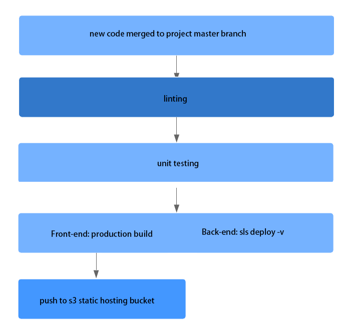
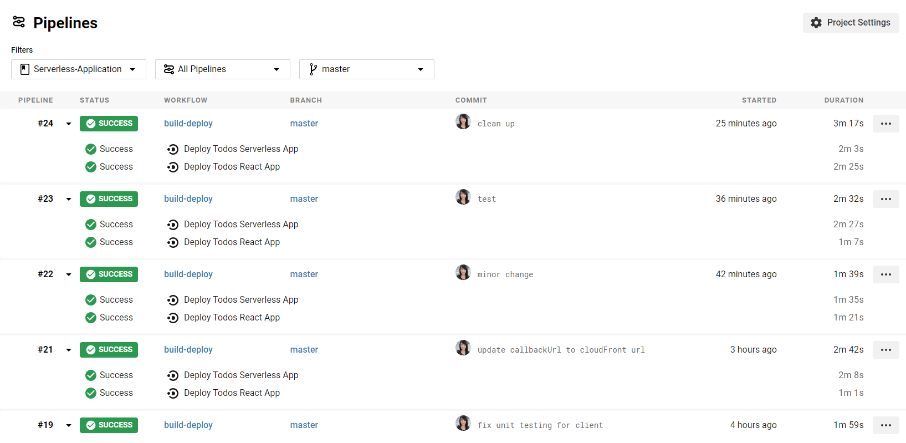
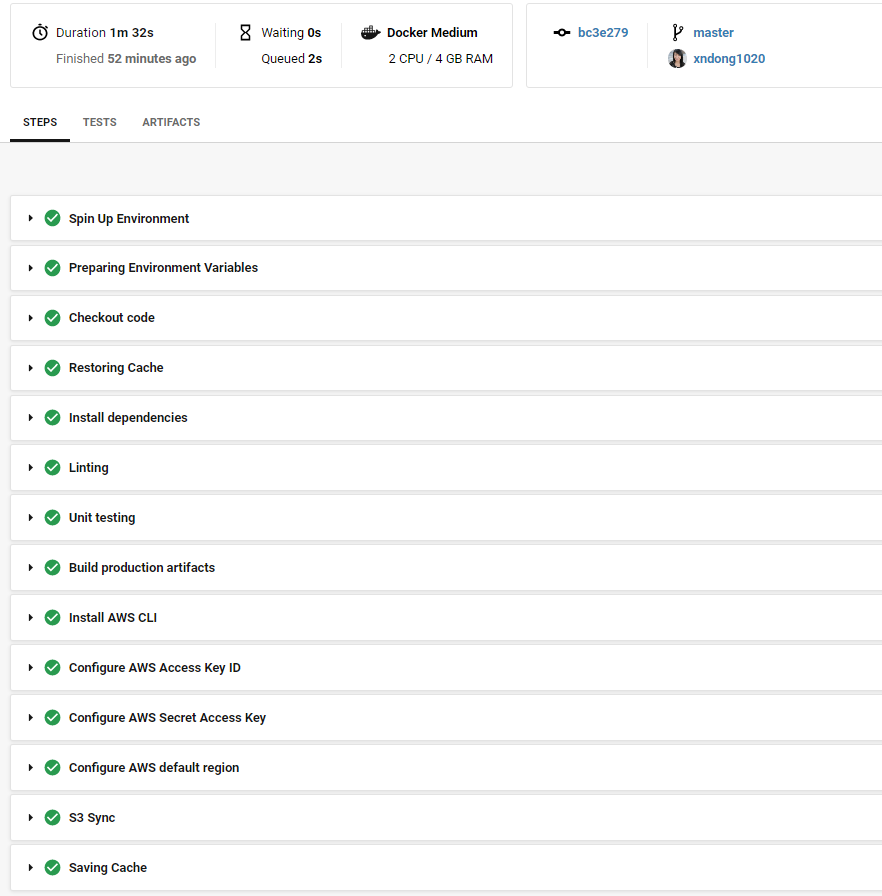
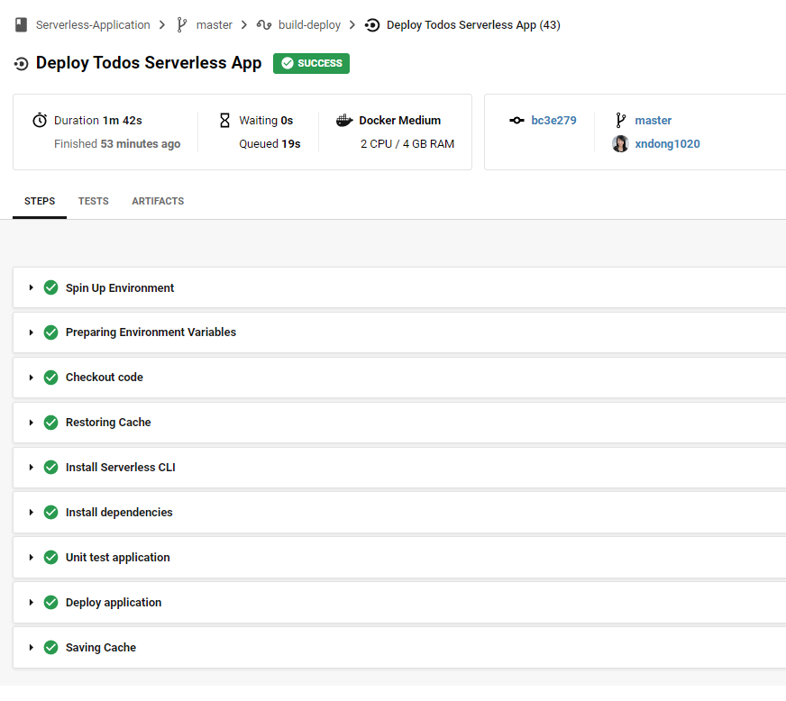
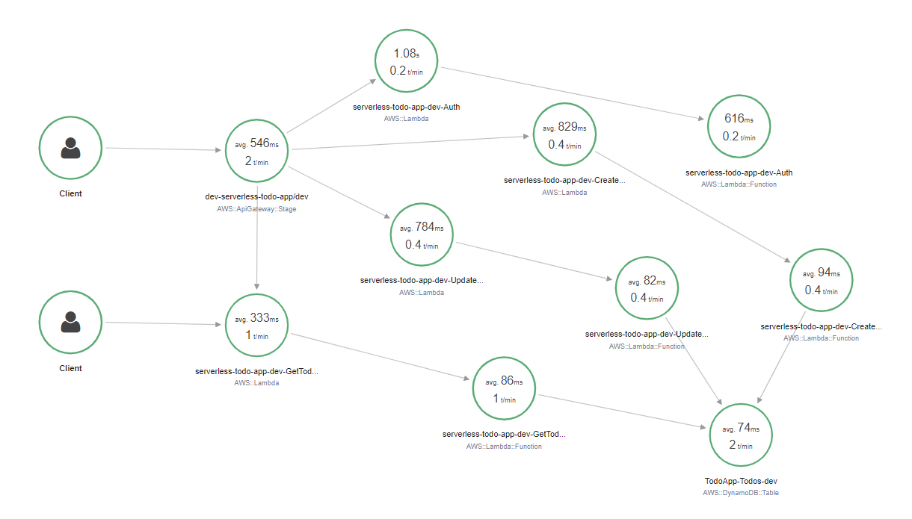
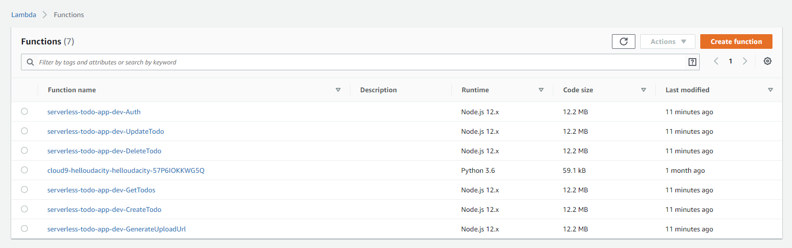
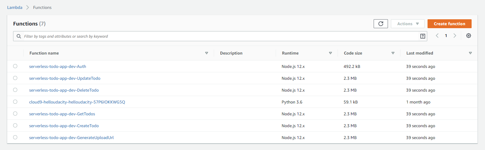

### Serverless Todo App with CI/CD pipeline

[](https://github.com/xndong1020/Serverless-Application)

#### pipeline using circleci





**Front-end build**


**Back-end build**


#### AWS X-Ray Enabled



#### Package Individually

Before:


After:


#### How to run

**back-end (serverless restful api)**

```sh
cd backend
npm i

# for unit tests
npm test

# for deployment
sls deploy -v
```

**frontend (React app)**

```sh
cd client
npm i

# for linting
npm run lint

# for unit tests
npm test

# for local development
npm start
```

**Demo website** is [here](http://my-cloud-dev-s3.s3-website-us-west-2.amazonaws.com/)
